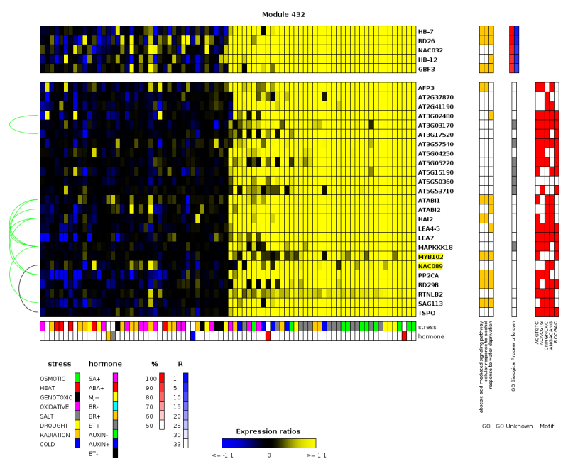

## About  ###
ModuleViewer is a tool to directly generate annotated heat maps from gene clusters and diverse biological data. It visualizes gene expression profiles and co-regulated gene clusters and their predicted regulators in the context of regulatory networks.




## File Types  ####

Creation of images relies on at least two types of data: the data matrix and the modules file. Optionally, this can be extended with regulator data, a condition tree, and annotation files.

* **data matrix**: This TAB-delimited file describes the expression data. The header contains the name of all experiments (conditions), the first column represents gene names. The second column can be left empty, or be used for symbolic gene names. The rest of the data consists of the expression data. 
* **gene file**: Either an [XML file](TreeFile.md) with modules and genes, possibly grouped together into a tree structure, or a [simple list](ListFile.md) of modules with their genes.
* **condition tree**: (optional) By default, each module displays all conditions, in the same order as given in the expression matrix. A more fine grained representation can be defined using an [XML file](TreeFile.md). This file specifies conditions to be displayed per module, possibly grouped together into a tree structure.
* **regulator tree**: (optional) [XML file](TreeFile.md) with regulator genes or a [simple list](ListFile.md) of regulators assigned to modules.
* **symbolic name mapping**: A tab delimted two column mapping file: GeneID --> Symbolic Name
* **annotations**: Most information that should be drawn around the central module matrices, can be described as: "Module number x lists genes or conditions y1, y2, y3, ... as having property z". Optionally each gene or condition can be linked to an extra data point (color, integer, ...). For this purpose, we created the [MVFFormat](MVFFormat.md).

Demo data can be downloaded here: [Demo Data](ModuleViewerDemoData.md).

The regulator tree lets the user visualize regulators or other genes associated with the module, as an extra matrix above the main gene expression matrix.
These "associated genes" can even be a complete other module, so *two modules can be compared to each other*. To do this, make a copy of the original gene file, but replace the module ID of the modules to be compared, with the ID of the modules to be compared to. Then load this second file as a "regulator file". In a similar way, a new MVF file could be constructed, copying the original file, replacing the module IDs and changing the OBJECT key from GENES to REGULATORS.

## Running ModuleViewer ######

ModuleViewer is a Java application. Make sure you have installed a [Java Runtime Environment][java].

[java]: https://www.java.com/en/download/

### Start ModuleViewer ####

[](http://bioinformatics.psb.ugent.be/webtools/moduleviewer/launch.jnlp)

### Demo with pre-loaded data ####

[](http://bioinformatics.psb.ugent.be/webtools/moduleviewer/launch.jnlp?expmatrix=http://bioinformatics.psb.ugent.be/webtools/moduleviewer/testdata/hughratcur/hughratcur_nan_filtered&modules=http://bioinformatics.psb.ugent.be/webtools/moduleviewer/testdata/hughratcur/hughratcur_nan_filtered_geneTree.xml&conditions=http://bioinformatics.psb.ugent.be/webtools/moduleviewer/testdata/hughratcur/hughratcur_nan_filtered_conditionTree.xml&regulators=http://bioinformatics.psb.ugent.be/webtools/moduleviewer/testdata/hughratcur/hughratcur_nan_filtered_regulatorTree.xml&annotations=http://bioinformatics.psb.ugent.be/webtools/moduleviewer/testdata/hughratcur/Annotations.mvf)
 (Yeast)

[](http://bioinformatics.psb.ugent.be/webtools/moduleviewer/launch.jnlp?expmatrix=http://bioinformatics.psb.ugent.be/webtools/moduleviewer/testdata/abiotic_stress/ATH1stress_expr&modules=http://bioinformatics.psb.ugent.be/webtools/moduleviewer/testdata/abiotic_stress/kmclust600_2014&regulators=http://bioinformatics.psb.ugent.be/webtools/moduleviewer/testdata/abiotic_stress/kmclust600_2014_reg&annotations=http://bioinformatics.psb.ugent.be/webtools/moduleviewer/testdata/abiotic_stress/annotations.mvf&synonyms=http://bioinformatics.psb.ugent.be/webtools/moduleviewer/testdata/abiotic_stress/ath_symbol_2013)
 (Arabidopsis)
### Run locally ###

Alternatively, you can clone the code from the repository (master or stable tag), compile it using [maven][] and run it from the command line. Maven will take care of downloading the dependencies. The dependency on [ModuleGraphics][] is not served from any maven repository (yet), so you need to clone that code and maven install it first.

[webstart]: http://bioinformatics.psb.ugent.be/webtools/moduleviewer/launch.jnlp
[maven]: https://maven.apache.org/
[ModuleGraphics]: https://gitlab.psb.ugent.be/thpar/ModuleGraphics

## Command line options #########

Both the command line and the webstart version allow to specify input files at launch. This allows an application or pipeline to automatically open ModuleViewer to show output figures.
Files can be either local files or URLs.

```
usage: ModuleViewer
-a,--annotations <annotation file>   One or more MVF annotation files
-c,--conditions <condition file>     Condition tree file
-e,--expmatrix <matrix file>         The expression matrix
-h,--help                            Show this help
-m,--modules <module file>           Module file (XML or flat list)
-r,--regulators <regulator file>     Regulator file (XML or flat list)
-s,--synonyms <synonym file>         Gene ID - synonym mapping
```
